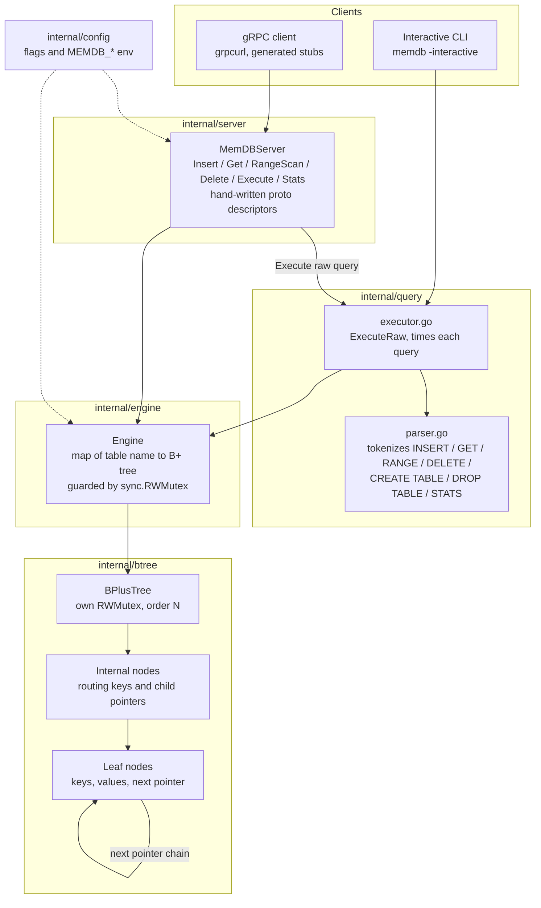

# mem-db

An in-memory database engine with B+ tree indexing, concurrent read/write support, range scans, a query execution layer, and gRPC API. Written in Go.

## Architecture



The gRPC server and the interactive CLI are two front ends over the same
`Engine`; every table is one independent B+ tree, so table-level locking in the
engine only guards the map itself while each tree holds its own `RWMutex`.

### Lookup and range scan



## How It Works

Data is stored in B+ trees (order 128 by default). Each table maps to one B+ tree. Keys are strings, values are arbitrary byte slices.

**B+ tree properties:**
- Internal nodes store only keys and child pointers for routing
- Leaf nodes store key-value pairs and are linked together for efficient range scans
- Nodes split when they reach the configured order (max keys per node)
- All data lives at the leaf level
- Read operations use `sync.RWMutex` for concurrent access

## Prerequisites

- Go 1.22+

## Building

```bash
cd mem_db
go mod tidy
go build -o memdb ./cmd/memdb
```

## Running

### Server mode (gRPC on :50051)

```bash
./memdb
# or with custom address:
./memdb -addr :9090
```

### Interactive CLI mode

```bash
./memdb -interactive
```

### Flags

| Flag | Default | Description |
|------|---------|-------------|
| `-addr` | `:50051` | gRPC listen address |
| `-default-table` | `default` | Name of the default table created at startup |
| `-order` | `128` | B+ tree order (max keys per node) |
| `-interactive` | `false` | Start in interactive CLI mode |

Environment variables `MEMDB_ADDR` and `MEMDB_DEFAULT_TABLE` are also supported.

## Query Language

Supported commands in interactive mode and via the `Execute` gRPC RPC:

```
INSERT <table> <key> <value>       Insert or update a key-value pair
GET <table> <key>                  Retrieve a value by key
RANGE <table> <startKey> <endKey>  Range scan (inclusive on both ends)
DELETE <table> <key>               Delete a key
CREATE TABLE <name>                Create a new table
DROP TABLE <name>                  Drop a table
STATS                              Show database statistics
```

### Examples

```
memdb> INSERT default user:1 {"name":"alice","age":30}
OK (1.2us)
memdb> GET default user:1
OK (800ns)
{"name":"alice","age":30}
memdb> INSERT default user:2 {"name":"bob","age":25}
OK (1.1us)
memdb> RANGE default user:1 user:9
OK (1.5us)
2 rows
  user:1 = {"name":"alice","age":30}
  user:2 = {"name":"bob","age":25}
memdb> STATS
OK (500ns)
tables: 1, total_keys: 2
  default: keys=2 height=1 order=128
memdb> DELETE default user:1
OK (900ns)
```

## gRPC API

Service definition is in `proto/memdb.proto`. RPCs:

| RPC | Description |
|-----|-------------|
| `Insert(InsertRequest)` | Insert a key-value pair |
| `Get(GetRequest)` | Get a value by key |
| `RangeScan(RangeScanRequest)` | Server-streaming range scan |
| `Delete(DeleteRequest)` | Delete a key |
| `Execute(QueryRequest)` | Execute a raw query string |
| `Stats(StatsRequest)` | Get database statistics |

The server uses hand-written proto types (no protoc/codegen dependency required).

Example with `grpcurl`:

```bash
grpcurl -plaintext -d '{"table":"default","key":"foo","value":"YmFy"}' \
  localhost:50051 memdb.MemDB/Insert

grpcurl -plaintext -d '{"table":"default","key":"foo"}' \
  localhost:50051 memdb.MemDB/Get
```

## Test

```bash
go test ./...
go test -race ./internal/btree/...
```

Unit tests cover B+ tree insert/get/delete, leaf splits, range scan ordering across leaf-sibling pointers, and concurrent readers under `-race`.

End-to-end smoke against a running server:

```bash
./memdb &
grpcurl -plaintext -d '{"table":"default","key":"k1","value":"djE="}' \
  localhost:50051 memdb.MemDB/Insert
grpcurl -plaintext -d '{"table":"default","key":"k1"}' \
  localhost:50051 memdb.MemDB/Get
grpcurl -plaintext -d '{"table":"default","start_key":"k","end_key":"k~"}' \
  localhost:50051 memdb.MemDB/RangeScan
```

## Docker

```bash
cd deploy
docker compose up --build
```

The server will be available on port 50051.

## Repository Layout

```
cmd/memdb/main.go          Entry point, flag parsing, signal handling
internal/
  btree/
    node.go                B+ tree node types (leaf + internal)
    btree.go               B+ tree operations (insert, get, delete, range scan)
  engine/
    engine.go              Multi-table engine, dispatches to B+ trees
  query/
    parser.go              Query string parser
    executor.go            Query executor, bridges parser to engine
  server/
    grpc_server.go         gRPC service with hand-written descriptors
  config/
    config.go              Configuration from flags/env
proto/
  memdb.proto              gRPC service definition (reference)
deploy/
  Dockerfile               Multi-stage build
  docker-compose.yml       Single-service compose
```
